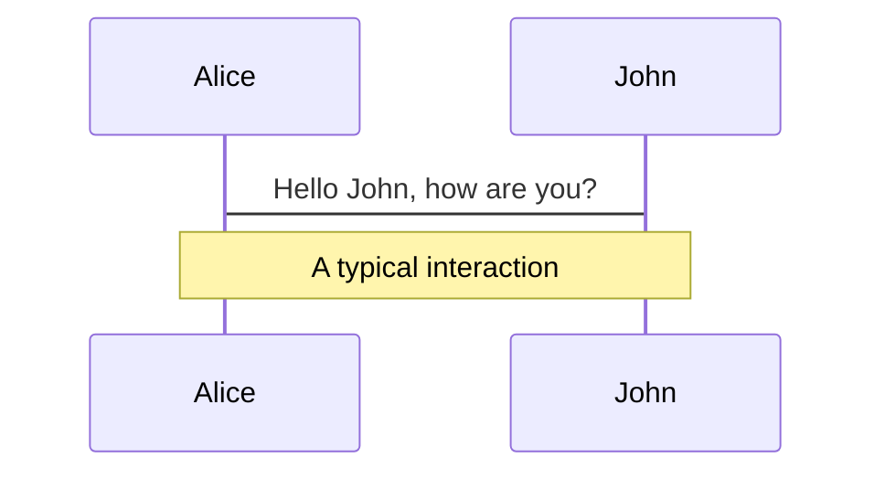
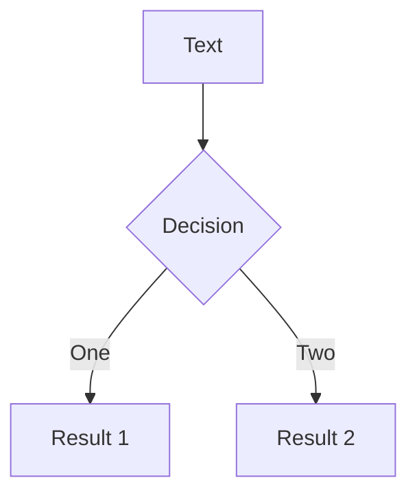

# ブラウザっぽいポートフォリオ作ってみた

<div class="pt-12">
  <span @click="$slidev.nav.next" class="text-xl px-2 p-1 rounded cursor-pointer" hover="bg-white bg-opacity-10">
    PE5U1G 山﨑 翔太
  </span>
</div>

<a href="https://github.com/yamawo" target="_blank" alt="GitHub"
  class="abs-br m-6 text-xl icon-btn opacity-50 !border-none !hover:text-white">
<carbon-logo-github />
</a>

---

# アジェンダ

<br>
<br>

- **制作物の紹介**
- **実装の一部見せます**
- **おまけ**

<br>
<br>
<br>

<style>
h1 {
  background-color: #2B90B6;
  background-image: linear-gradient(45deg, #4EC5D4 10%, #146b8c 20%);
  background-size: 100%;
  -webkit-background-clip: text;
  -moz-background-clip: text;
  -webkit-text-fill-color: transparent; 
  -moz-text-fill-color: transparent;
}
</style>

---

# 制作物の紹介

<div>

</div>

---

# 制作物の紹介

|                                         |                                                                                                                       |
| --------------------------------------- | --------------------------------------------------------------------------------------------------------------------- |
| <kbd class="ml-2 mr-24">使用技術</kbd>  | Next.js, TypeScript, CSS Modules, TailwindCSS, vercel                                                                 |
| <kbd class="ml-2 mr-24">目的/動機</kbd> | <span class="inline-block mb-2">Next.js 使ってみたかった</span><br>ブラウザの動き、ある程度 JavaScript で再現出来そう |
| <kbd class="ml-2 mr-24">期間</kbd>      | 丸 4 日程度                                                                                                           |

---

# 実装の一部見せます

ブラウザの切り替えを行っている部分までの処理を追ってみます
<br>
<br>

pages/index.tsx

```ts {all|4|5}
export const Home: NextPage = () => {
  return (
    <>
      <div className={`${styles.screen} w-screen h-screen bg-cover`}>
        <Browser />
      </div>
    </>
  );
};
```

---

# 実装の一部見せます

様々なコンポーネントの親となる Browser コンポーネント
<br>

components/domain/browser/Browser.tsx

```ts {all|2|4-9|13-16}
export const Browser: React.FC = () => {
  const [selectedTabNumber, setSelectedTabNuber] = React.useState<TabNumber>(0);

  const handleClickTab = React.useCallback(
    (tabNumber: TabNumber): void => {
      setSelectedTabNuber(tabNumber);
    },
    [selectedTabNumber]
  );

  return (
    ...
    <Tab
      selectedTabNumber={selectedTabNumber}
      onClickTab={handleClickTab}
    />
    ...
  );
};
```

---

# 実装の一部見せます

Tab 部分のコンポーネント
<br>

components/domain/navigation/tab/Tab.tsx

```ts {all|11-13}
export const Tab: React.FC<Props> = ({ selectedTabNumber, deletedTabAry, onClickTab, onClickDeleteTab }) => {
  const tabList = ["Home", "Skills", "Works"];

  const handleClickTab = React.useCallback(
    (e: React.MouseEvent<HTMLDivElement, MouseEvent>): void => {
      onClickTab(Number.parseInt(e.currentTarget.dataset.id, 10) as TabNumber);
    },
    [onClickTab]
  );

  return (
    ...
  );
};
```

---

# 実装の一部見せます

Tab コンポーネント JSX 部分
<br>

components/domain/navigation/tab/Tab.tsx

```ts
return (
  <>
    {tabList.map((t, index) => (
      <div
        className={
          selectedTabNumber === index
            ? `${styles.selected} ${styles.tab}`
            : `${styles.tab}`
        }
        onClick={handleClickTab}
      >
        ...
        {selectedTabNumber === index
          ? {
              /* 選択されている Tab を装飾するための html タグ */
            }
          : null}
      </div>
    ))}
  </>
);
```

---

# おわり

<br>
<br>

### いかがでしたでしょうか。

### 今後も気まぐれにエンハンスをしていくつもりなので、もっとコードをちゃんと見たい

### 方は、https://yamawo.info へアクセスしてみて下さい！

<style>
h3 {
  font-size: 20px;
  background-color: #ffffff;
  -webkit-background-clip: text;
  -moz-background-clip: text;
  -webkit-text-fill-color: transparent; 
  -moz-text-fill-color: transparent;
}
</style>

---

# おまけ

<style>
h1 {
  font-size: 60px;
  text-align: center;
  margin-top: 200px;
}
</style>

---

# 今回使用したこのスライドの紹介

<br>

## Slidev

|                                    |                                                                                                                                                                                                                                                                                                                                                                      |
| ---------------------------------- | -------------------------------------------------------------------------------------------------------------------------------------------------------------------------------------------------------------------------------------------------------------------------------------------------------------------------------------------------------------------- |
| <kbd class="ml-2 mr-24">特徴</kbd> | <span class="inline-block mb-2">・マークダウンでスライド作成可能</span><br><span class="inline-block mb-2">・スライドに CSS 形式のスタイルを適用可能</span><br><span class="inline-block mb-2">・コードの埋め込み、ハイライトが出来る</span><br><span class="inline-block mb-2">・Vue3 で作られているので Vue コンポーネントを埋めたりも出来る</span><br>などなど... |

<div class="flex ml-90">
<Tweet id="1390115482657726468" scale="0.65" />
</div>

--

# Code

Use code snippets and get the highlighting directly[^1]!

```ts {monaco}
interface User {
  id: number;
  firstName: string;
  lastName: string;
  role: string;
}

function updateUser(id: number, update: User) {
  const user = getUser(id);
  const newUser = { ...user, ...update };
  saveUser(id, newUser);
}
```

<arrow v-click="3" x1="400" y1="420" x2="230" y2="330" color="#564" width="3" arrowSize="1" />

[^1]: [Learn More](https://sli.dev/guide/syntax.html#line-highlighting)

<style>
.footnotes-sep {
  margin-top: 3em;
}
.footnote-backref {
  display: none
}
</style>

---

# Components

<div grid="~ cols-2 gap-4">
<div>

You can use Vue components directly inside your slides.

We have provided a few built-in components like `<Tweet/>` and `<Youtube/>` that you can use directly. And adding your custom components is also super easy.

```html
<Counter :count="10" />
```

<!-- ./components/Counter.vue -->
<Counter :count="10" m="t-4" />

Check out [the guides](https://sli.dev/builtin/components.html) for more.

</div>
<div>

```html
<Tweet id="1390115482657726468" />
```

<Tweet id="1390115482657726468" scale="0.65" />

</div>
</div>

---

# Themes

Slidev comes with powerful theming support. Themes can provide styles, layouts, components, or even configurations for tools. Switching between themes by just **one edit** in your frontmatter:

<div grid="~ cols-2 gap-2" m="-t-2">

```yaml
---
theme: default
---
```

```yaml
---
theme: seriph
---
```


</div>

Read more about [How to use a theme](https://sli.dev/themes/use.html) and
check out the [Awesome Themes Gallery](https://sli.dev/themes/gallery.html).

---

# Animations

Animations are powered by [@vueuse/motion](https://motion.vueuse.org/).

```html
<div v-motion :initial="{ x: -80 }" :enter="{ x: 0 }">Slidev</div>
```

<div class="w-60 relative mt-6">
  <div class="relative w-40 h-40">
    
    
    
  </div>

  <div 
    class="text-5xl absolute top-14 left-40 text-[#2B90B6] -z-1"
    v-motion
    :initial="{ x: -80, opacity: 0}"
    :enter="{ x: 0, opacity: 1, transition: { delay: 2000, duration: 1000 } }">
    Slidev
  </div>
</div>

<!-- vue script setup scripts can be directly used in markdown, and will only affects current page -->
<script setup lang="ts">
const final = {
  x: 0,
  y: 0,
  rotate: 0,
  scale: 1,
  transition: {
    type: 'spring',
    damping: 10,
    stiffness: 20,
    mass: 2
  }
}
</script>

<div
  v-motion
  :initial="{ x:35, y: 40, opacity: 0}"
  :enter="{ y: 0, opacity: 1, transition: { delay: 3500 } }">

[Learn More](https://sli.dev/guide/animations.html#motion)

</div>

---

# LaTeX

LaTeX is supported out-of-box powered by [KaTeX](https://katex.org/).

<br>

Inline $\sqrt{3x-1}+(1+x)^2$

Block

$$
\begin{array}{c}

\nabla \times \vec{\mathbf{B}} -\, \frac1c\, \frac{\partial\vec{\mathbf{E}}}{\partial t} &
= \frac{4\pi}{c}\vec{\mathbf{j}}    \nabla \cdot \vec{\mathbf{E}} & = 4 \pi \rho \\

\nabla \times \vec{\mathbf{E}}\, +\, \frac1c\, \frac{\partial\vec{\mathbf{B}}}{\partial t} & = \vec{\mathbf{0}} \\

\nabla \cdot \vec{\mathbf{B}} & = 0

\end{array}
$$

<br>

[Learn more](https://sli.dev/guide/syntax#latex)

---

# Diagrams

You can create diagrams / graphs from textual descriptions, directly in your Markdown.

<div class="grid grid-cols-2 gap-10 pt-4 -mb-6">





</div>

[Learn More](https://sli.dev/guide/syntax.html#diagrams)
